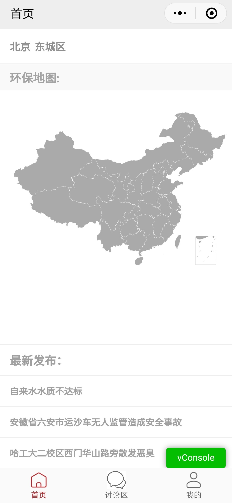
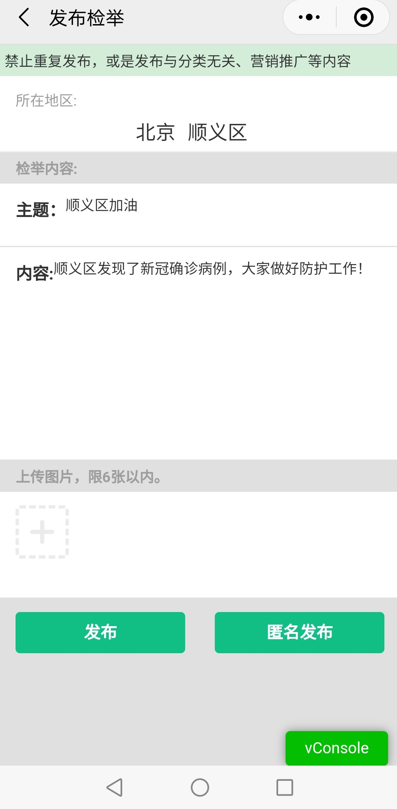
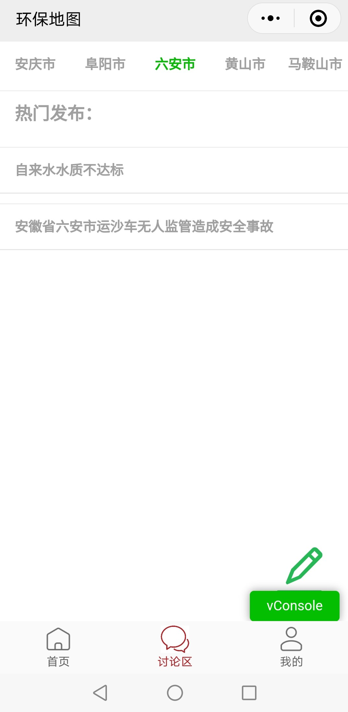
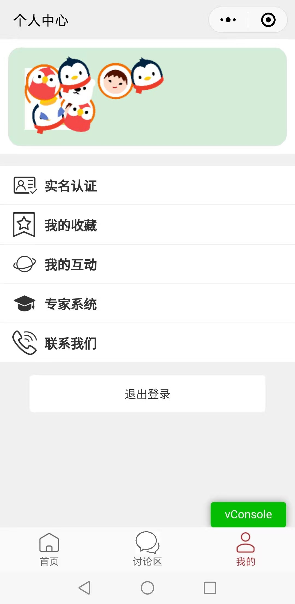

## 前言 ##
EPM是一个论坛小程序，里面集成了`echarts`中国地图，可以通过点击地图上的省份以及通过二级选择框进行省和市级跳转，进入某一个省市的论坛版块。该项目实现了基本的论坛功能，包括发帖，匿名发帖，上传图片，跟帖，收藏等功能。

## 小程序前端介绍 ##
首页：   
首页使用echarts来实现地图展示。需要下载相应地图文件 见
`index/china.js`。地图的设置见`index.js`中的`initChart`函数。地图的点击功能需要通过`echarts`自带的 `chart.on('click',(e) =>`来实现。地图可以实现拖动和放大。
上面二级选择框可以选择省市，之后可以跳转到相应的省市讨论区论坛界面。或者通过点击地图上某一个省份来进行跳转。
下面的 **最新发布** 是选出了所有省市的最新发布或者跟帖的若干个帖子。

讨论区：  
讨论区是各个省的论坛。最上面可以选择该省下的其他市区进行跳转。
点击相关标题即可进入帖子。在帖子里可以进行跟帖。
点击右下角的铅笔符号可以发帖。发帖可以上传图片。也可以选择匿名发帖。
帖子标题的右边有个五角星符号，点击可以进行收藏。收藏的帖子在“**我的**”页面的“**我的收藏**”中查看。

我的：  
我的页面采用微信登录的方式。仅实现了“**我的收藏**”页面的收藏功能。以及“**联系我们**”有个简单的页面

## 后端技术 ##
MySQL  
Redis  
Mybatis  
OSS  
SpringBoot  
JWT  
Swagger-UI  
## 项目部署 ##
1. 下载代码
2. 部署后端程序，并根据自己的信息修改`application.yml`文件，填写服务器ip地址，MySQL，redis账号信息，aliyun信息以及小程序AppID和密钥；修改`generator.properties`文件中的服务器ip地址；修改`generatorConfig.xml`中指定生成model，mapper.xml,mapper接口的路径
3. 下载前端代码，并填写自己的AppID。在`configs/api.js`中填写自己的服务器ip# Environment-Protect-Map
